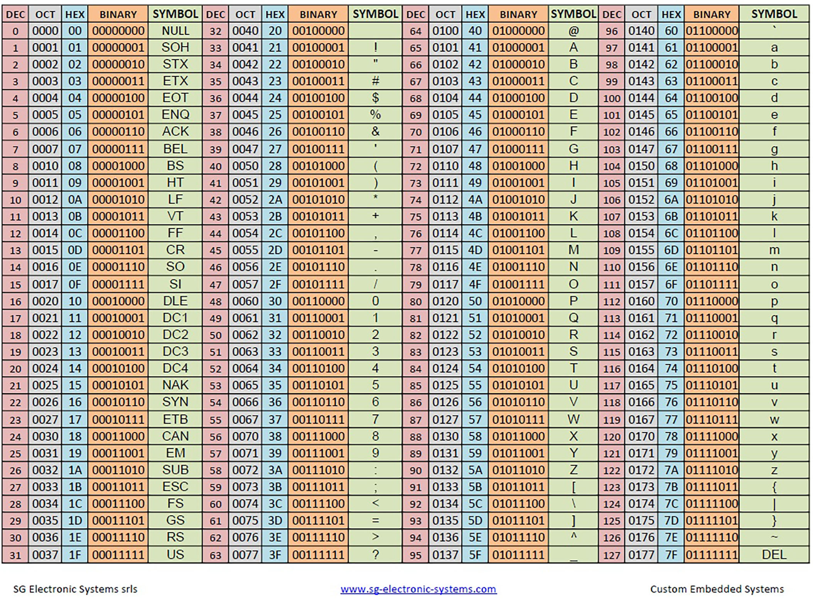

# SP分支
- 采用了策略模式
# **应用简介**

本团队由一群应用开发初学者组成，将伴随学习过程开发的项目托管到 **GitHub**，既方便管理，同时也培养了团队的程序开发规范性、互动性。

这是团队开发的一个随机密码生成器，基于 ***[.NET 6.0 控制台](https://dotnet.microsoft.com/zh-cn/download/dotnet/6.0)*** 框架，欢迎大家试用。

## **算法说明**

### 字符取值范围：ASCII 码 33-126，共94个

######   
- 获取字符池，包含所有 ASCII 表中可用的字符，如数字、字母、符号（不包含空格、DEL 等）。
- 字符池排列顺序：数字-字母-符号（默认字母为必须，因此放在中间）。
- 根据密码长度，生成字符数组，每个元素都从字符池中随机取值。
- 密码字符取值类型采用了枚举（Flags）进行判定。
  
  
# **团队合影**

